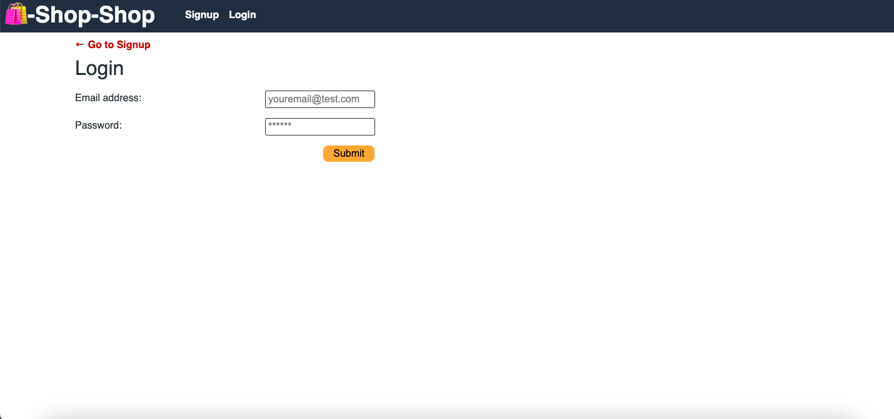
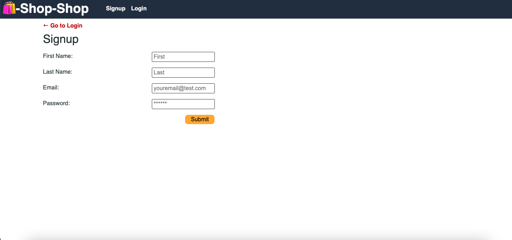

# State-Redux-Store

 * [Description](#Description)
 * [User-Story](#User-Story)
 * [Acceptance-Criteria](#Acceptance-Criteria)
 * [Website](#Website)
 * [Installation](#Installation)
 * [Usage](#Usage)
 * [License](#License)

## Description

Refactor the e-commerce platform from [Activity 26] so that it uses [Redux].






## User-Story

```md
AS a senior engineer working on an e-commerce platform
I WANT my platform to use Redux to manage global state instead of the Context API
SO THAT my website's state management is taken out of the React ecosystem
```

## Acceptance-Criteria

```md
GIVEN an e-commerce platform that uses Redux to manage global state
WHEN I review the app’s store
THEN I find that the app uses a Redux store instead of the Context API
WHEN I review the way the React front end accesses the store
THEN I find that the app uses a Redux provider
WHEN I review the way the app determines changes to its global state
THEN I find that the app passes reducers to a Redux store instead of using the Context API
WHEN I review the way the app extracts state data from the store
THEN I find that the app uses Redux instead of the Context API
WHEN I review the way the app dispatches actions
THEN I find that the app uses Redux instead of the Context API
```
## Website 

https://state-redux-store-g95g.onrender.com

## Installation

Run the following command `npm i` to install the following dependencies:

` server:  
    "@apollo/server": "^4.7.2",
    "bcrypt": "^4.0.1",
    "express": "^4.17.2",
    "graphql": "^16.6.0",
    "jsonwebtoken": "^8.5.1",
    "mongoose": "^7.0.2",
    "stripe": "^8.67.0" 
`

`client: 
    "@apollo/client": "^3.7.15",
    "@stripe/stripe-js": "^1.54.0",
    "@testing-library/react": "^14.0.0",
    "graphql": "^16.6.0",
    "happy-dom": "^9.20.3",
    "jwt-decode": "^3.1.2",
    "react": "^18.2.0",
    "react-dom": "^18.2.0",
    "react-redux": "^8.0.7",
    "react-router-dom": "^6.11.2",
    "redux": "^4.2.1",
    "vitest": "^0.32.0"
`


## Usage

Use the app by running the following commands below and then follow the above criteria.

`npm run build
 npm run seed
 npm run develop`

## License

This project uses MIT License